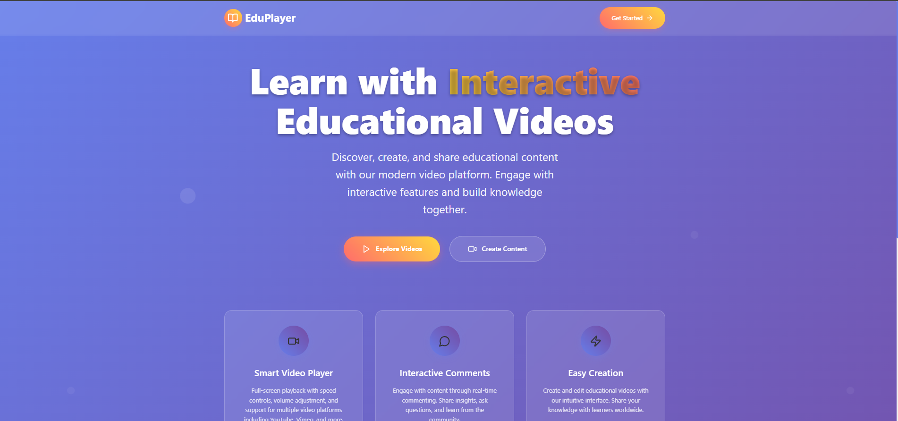
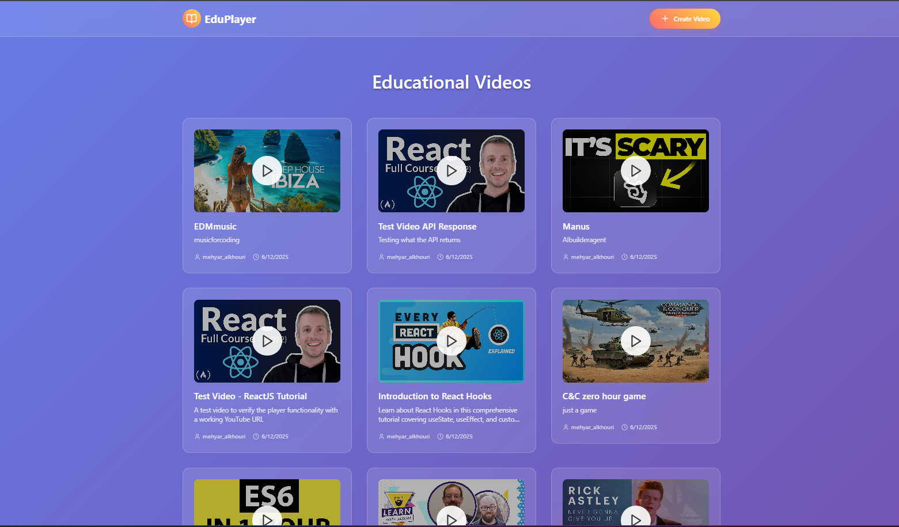
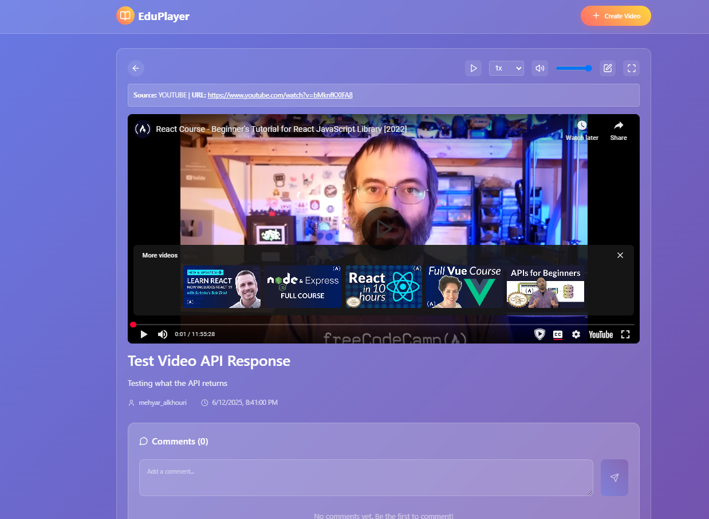
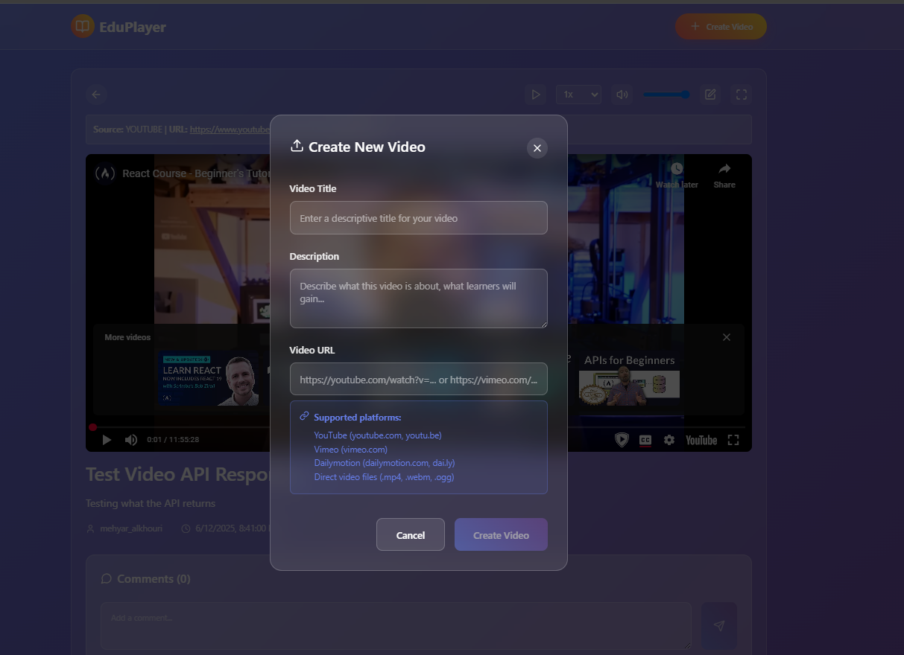
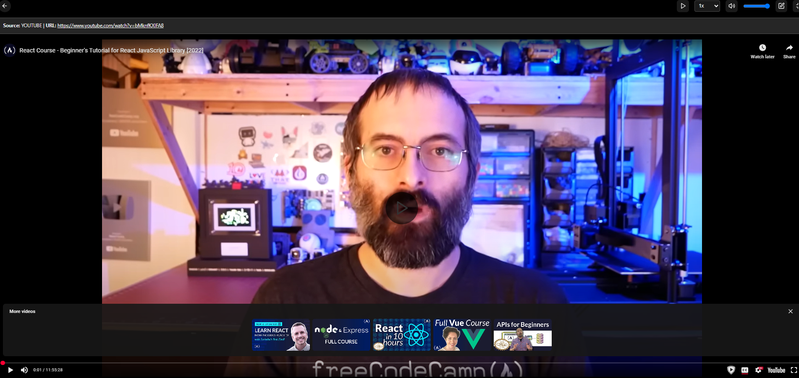

# Educational Video Player

A modern React-based educational video platform that allows users to create, comment on, and watch educational videos. Built with TypeScript, Redux Toolkit, and styled-components for a seamless and engaging user experience.

## Overview of Solution and Features

This educational video platform is a comprehensive React application designed specifically for educational content creation and consumption. The solution provides:

### Core Functionality (As Required)
- ✅ **Video List Display**: Shows all available videos with the ability to select and play them
- ✅ **Video Creation**: Allows users to create new video objects with title, description, and video URL
- ✅ **Interactive Commenting**: Users can comment on videos and view comments from other users
- ✅ **Full-Screen Playback**: Opens videos in full-screen mode with complete playback functionality
- ✅ **Playback Controls**: Includes options for adjusting playback speed (0.5x to 2x) and volume control

### Additional Features
- **Splash Page**: Engaging landing page with platform overview and call-to-actions
- **Modern UI Design**: Glass-morphism design with smooth animations and responsive layout
- **YouTube Integration**: Displays video thumbnails for supported platforms
- **Video Editing**: Ability to modify existing video details
- **URL Validation**: Automatically filters and validates video URLs
- **Error Handling**: Comprehensive error management with user-friendly messages
- **Mobile Responsive**: Optimized for all device sizes

### Technology Stack
- **Frontend Framework**: React 18 with TypeScript
- **State Management**: Redux Toolkit for predictable state updates
- **Styling**: Styled Components with CSS-in-JS
- **Video Player**: React Player for multi-platform support
- **Routing**: React Router DOM for navigation
- **HTTP Client**: Axios for API communication
- **Icons**: Lucide React for modern iconography

## How to Build and Run

### Prerequisites
- Node.js (v16 or higher)
- npm or yarn package manager

### Installation Steps

1. **Clone the repository**
   ```bash
   git clone https://github.com/your-username/scope-labs-mehyar.git
   cd scope-labs-mehyar
   ```

2. **Install dependencies**
   ```bash
   npm install
   ```

3. **Configure User ID** (Required)
   Update the `USER_ID` constant in:
   - `src/components/VideoList/VideoList.tsx` (line 153)
   - `src/components/CreateVideoModal/CreateVideoModal.tsx` (line 295)
   
   Replace `'mehyar_alkhouri'` with your name in `first_last` format (e.g., `'john_smith'`)

4. **Start the development server**
   ```bash
   npm start
   ```
   The application will open at `http://localhost:3000`

### Production Build

```bash
npm run build
```
Creates an optimized production build in the `build/` folder ready for deployment.

### Testing the Build
```bash
npm test
```
Runs the test suite to verify functionality.

## Screenshots

### 1. Splash Page - Landing Experience

*Modern landing page with feature highlights, hero section, and clear call-to-action buttons*

### 2. Video List - Browse Content

*Grid layout showing videos with YouTube thumbnails, titles, descriptions, and metadata*

### 3. Video Player - Full Experience

*Complete video player with controls, comments section, and video information*

### 4. Create Video Modal - Content Creation

*Clean form interface for adding new educational videos with validation*

### 5. Full-Screen Mode - Immersive Viewing

*Distraction-free full-screen video playback with overlay controls*

## 🔧 API Integration & Testing

### Backend Requirements
The application expects a FastAPI backend with the following endpoints:

- `POST /api/videos` - Create new video
- `GET /api/videos?user_id={userId}` - Fetch user videos  
- `GET /api/videos/single?video_id={videoId}` - Get single video
- `PUT /api/videos` - Update video
- `POST /api/videos/comments` - Create comment
- `GET /api/videos/comments?video_id={videoId}` - Get comments

### Testing Instructions

1. **Setup Backend**: Ensure your FastAPI server is running on the same domain
2. **User Configuration**: Update USER_ID constants as mentioned above
3. **Test Video URLs**: Use valid YouTube, Vimeo, or direct video URLs
4. **Feature Testing**:
   - Create videos with different URL formats
   - Test full-screen mode and playback controls
   - Add comments and verify real-time updates
   - Edit video details and check validation

### Supported Video Platforms
- YouTube (youtube.com, youtu.be)
- Vimeo (vimeo.com)
- Dailymotion (dailymotion.com)
- Direct video files (.mp4, .webm, .ogg)

## 📱 Application Architecture

```
src/
├── components/           # React UI components
│   ├── Header/          # Navigation header
│   ├── SplashPage/      # Landing page
│   ├── VideoList/       # Video browsing
│   ├── VideoPlayer/     # Video playback
│   ├── CreateVideoModal/# Video creation
│   └── EditVideoModal/  # Video editing
├── store/               # Redux state management
│   └── slices/         # Feature-based state slices
├── services/            # API communication layer
├── types/               # TypeScript definitions
└── hooks/               # Custom React hooks
```

## 🎨 Design Features

- **Glass-morphism UI**: Modern frosted glass effects with backdrop blur (not apple liquid glass haha)
- **Responsive Layout**: Mobile-first design that works on all devices
- **Smooth Animations**: Hover effects and seamless transitions
- **Gradient Themes**: Beautiful color gradients throughout the interface
- **Accessibility**: Semantic HTML and keyboard navigation support

## ✅ Requirements Verification

**All requirements have been successfully implemented:**

- ✅ React + TypeScript platform
- ✅ Splash page with features and CTAs
- ✅ Video list with selection capability
- ✅ Create new videos functionality
- ✅ Interactive commenting system
- ✅ Full-screen video playback
- ✅ Speed and volume controls
- ✅ Modern, intuitive UI design
- ✅ API integration with backend
- ✅ Video filtering (URLs only)
- ✅ YouTube thumbnail display

## 🚦 Quick Start Guide

1. **First Visit**: Start at the splash page to understand platform features
2. **Browse Videos**: Click "Get Started" to view the video library
3. **Create Content**: Use "Create Video" button to add new educational videos
4. **Watch & Engage**: Select videos to watch and participate in discussions
5. **Full Experience**: Use full-screen mode for immersive learning

## 📋 Additional Information

### Browser Compatibility
- Chrome (recommended)
- Firefox
- Safari
- Edge

### Performance Features
- Code splitting for optimal loading
- Lazy loading of video components
- Optimized bundle size
- Responsive image loading

### Security & Validation
- Input sanitization and validation
- URL format verification
- Error boundary implementation
- Safe API error handling

---

**Built with ❤️ for educational excellence**

*This project demonstrates modern React development practices with TypeScript, Redux, and responsive design.*
