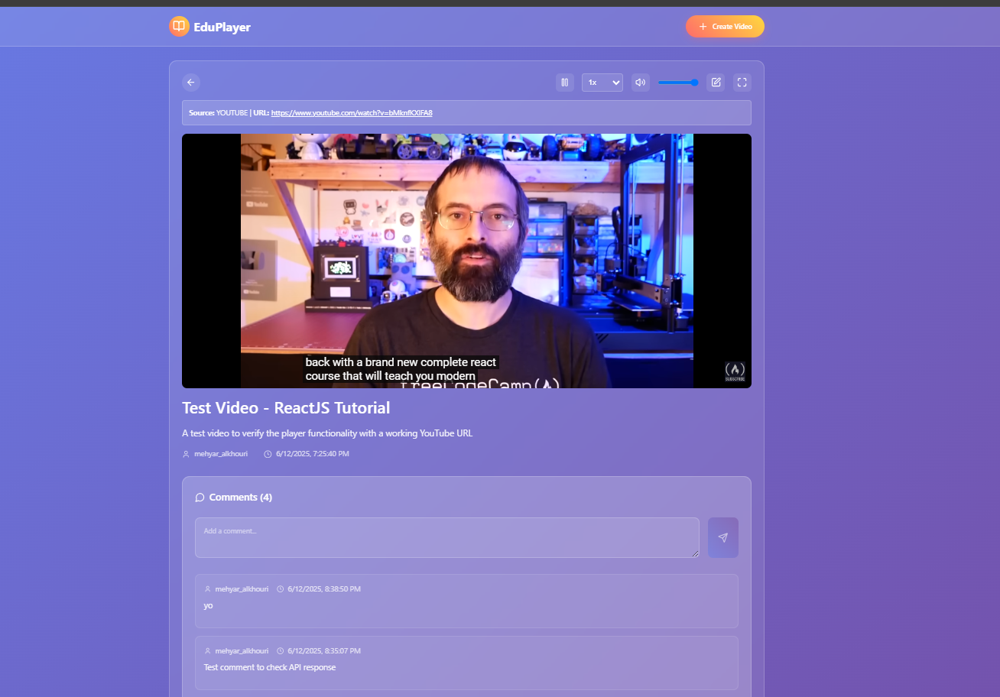

# Educational Video Player

A modern React-based educational video platform that allows users to create, comment on, and watch educational videos. Built with TypeScript, Redux Toolkit, and styled-components for a seamless and engaging user experience.

## Overview of Solution and Features

This educational video platform is a comprehensive React application designed specifically for educational content creation and consumption. The solution provides:

### Core Functionality (As Required)
- **Video List Display**: Shows all available videos with the ability to select and play them
- **Video Creation**: Allows users to create new video objects with title, description, and video URL
- **Interactive Commenting**: Users can comment on videos and view comments from other users
- **Full-Screen Playback**: Opens videos in full-screen mode with complete playback functionality
- **Playback Controls**: Includes options for adjusting playback speed (0.5x to 2x) and volume control

### Additional Features
- **Splash Page**: Engaging landing page with platform overview and call-to-actions
- **Modern UI Design**: Glass-morphism design with smooth animations and responsive layout
- **YouTube Integration**: Displays video thumbnails for supported platforms
- **Video Editing**: Ability to modify existing video details
- **URL Validation**: Automatically filters and validates video URLs
- **Error Handling**: Comprehensive error management with user-friendly messages
- **Mobile Responsive**: Optimized for all device sizes

### Technology Stack
- **Frontend Framework**: React 18 with TypeScript
- **State Management**: Redux Toolkit for predictable state updates
- **Styling**: Styled Components with CSS-in-JS
- **Video Player**: React Player for multi-platform support
- **Routing**: React Router DOM for navigation
- **HTTP Client**: Axios for API communication
- **Icons**: Lucide React for modern iconography

## Instructions to Build and Run the Application

### Prerequisites
- Node.js (version 16 or higher)
- npm package manager
- Modern web browser (Chrome, Firefox, Safari, or Edge)

### Step-by-Step Setup

1. **Clone the Repository**
   ```bash
   git clone https://github.com/your-username/scope-labs-mehyar.git
   cd scope-labs-mehyar
   ```

2. **Install Dependencies**
   ```bash
   npm install
   ```

3. **Configure Environment Variables**

   The application uses environment variables for API configuration and user ID.  
   Copy the example environment file and adjust as needed:

   ```bash
   cp .env.example .env
   ```

   - Edit `.env` to set your user ID (use your first and last name in snake_case, e.g., `john_smith`) and API base URL if needed.
   - The default user ID is set as `mehyar_alkhouri` in `.env.example`.

4. **Start the Development Server**
   ```bash
   npm start
   ```
   
   The application will automatically open in your browser at `http://localhost:3000`

5. **Create Production Build** *(Optional)*
   ```bash
   npm run build
   ```
   
   This creates an optimized production build in the `build/` folder

### API Integration Notes
- The application is configured to work with the provided backend API
- Ensure your backend server is running and accessible
- The app uses the configured user_id for creating video objects
- You can use any fake user_id when making comments during testing

## Screenshots of the Platform

### Application Views

#### 1. Splash Page

- Modern landing page with platform features overview
- Call-to-action buttons for getting started
- Responsive design showcasing the platform's capabilities

#### 2. Video List Interface

- Grid layout displaying all available videos
- YouTube thumbnail integration for visual appeal
- Video metadata including title, description, and creator information
- "Create Video" button for adding new content

#### 3. Video Player View

- Full-featured video player with React Player integration
- Comments section for user interaction
- Video information display (title, description, metadata)
- Playback controls with speed and volume adjustment

#### 4. Create Video Modal

- Clean form interface for adding new educational videos
- Input validation and error handling
- Support for various video URL formats (YouTube, Vimeo, direct links)

#### 5. Full-Screen Video Mode

- Immersive full-screen video experience
- Overlay controls for seamless interaction
- Distraction-free learning environment

#### 6. Comments System

- Real-time commenting functionality
- User identification for comment attribution
- Interactive discussion threads

## Additional Information for Testing

### Application Architecture

The application follows React best practices with a well-organized component structure:

```
src/
├── components/           # Reusable UI components
│   ├── Header/          # Navigation header with branding
│   ├── SplashPage/      # Landing page component
│   ├── VideoList/       # Video browsing and management
│   ├── VideoPlayer/     # Video playback functionality
│   ├── CreateVideoModal/# Video creation interface
│   └── EditVideoModal/  # Video editing interface
├── store/               # Redux state management
│   ├── store.ts        # Store configuration
│   └── slices/         # Feature-based state slices
├── services/            # API communication layer
│   └── api.ts          # Backend API integration
├── types/               # TypeScript type definitions
├── hooks/               # Custom React hooks
└── utils/               # Helper functions and utilities
```

### Design Philosophy

The application implements modern web design principles:

- **Glass-morphism UI**: Frosted glass effects with backdrop blur for a contemporary look
- **Responsive Design**: Mobile-first approach ensuring compatibility across all devices
- **Accessibility**: Semantic HTML structure and keyboard navigation support
- **Performance**: Optimized bundle size with code splitting and lazy loading
- **User Experience**: Smooth animations and intuitive navigation patterns

### Supported Video Formats

The application supports various video platforms and formats:

- **YouTube**: Full integration with thumbnail display and playback
- **Vimeo**: Professional video hosting platform support
- **Dailymotion**: Alternative video platform compatibility
- **Direct Video Files**: Support for .mp4, .webm, .ogg, and other formats
- **URL Validation**: Automatic filtering of invalid or unsupported URLs

### API Integration Details

The application integrates with a FastAPI backend using the following endpoints:

- `POST /api/videos` - Create new video entries
- `GET /api/videos?user_id={userId}` - Fetch videos for specific user
- `GET /api/videos/single?video_id={videoId}` - Retrieve single video details
- `PUT /api/videos` - Update existing video information
- `POST /api/videos/comments` - Add comments to videos
- `GET /api/videos/comments?video_id={videoId}` - Fetch video comments

### Testing Guidelines

1. **User Configuration**: Update the USER_ID constants with your snake_case name
2. **Video Creation**: Test with various URL formats (YouTube, Vimeo, direct links)
3. **Commenting System**: Add comments using different fake user IDs
4. **Playback Features**: Verify speed controls (0.5x - 2x) and volume adjustment
5. **Full-Screen Mode**: Test immersive viewing experience
6. **Responsive Design**: Check functionality across different screen sizes

### Browser Compatibility

- Chrome (recommended for best performance)
- Firefox (full feature support)
- Safari (optimized for macOS and iOS)
- Edge (Windows integration)

### Development Features

- **Hot Reloading**: Instant updates during development
- **Error Boundaries**: Graceful error handling with user feedback
- **TypeScript**: Full type safety and developer experience
- **Code Splitting**: Optimized loading for better performance
- **Modern ES6+**: Latest JavaScript features and best practices

---

**Built with modern React development practices for educational excellence.**

*This solution demonstrates componentization, state management, API integration, and responsive design following industry best practices.*
